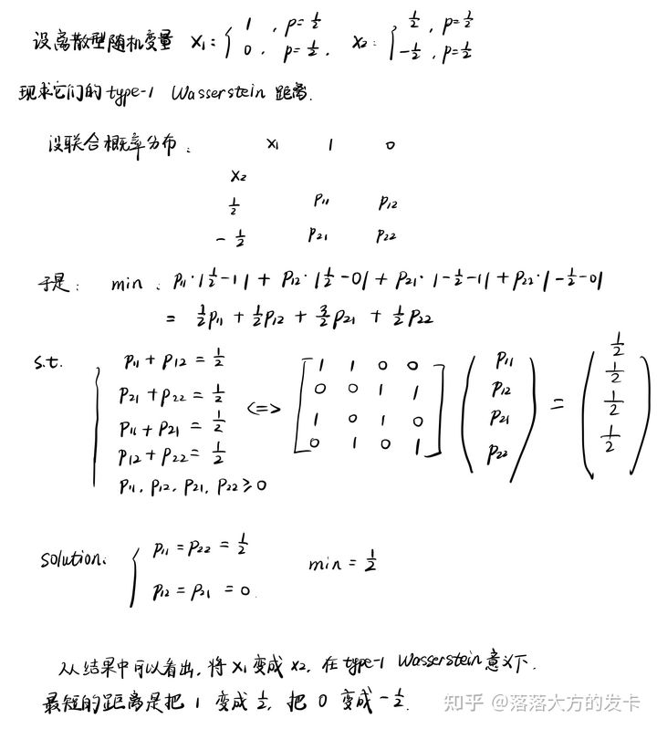

# 引言

## 参考文献

1. 配准和翘曲的最佳质量传输.pdf  Optimal Mass Transport for Registration and Warping
2. 从手工到深层特征的图像匹配：综述 Image Matching from Handcrafted to Deep Features: A Survey
3. 使用Wasserstein距离的基于表面的形状分类 Surface-based shape classification using Wasserstein distance
4. 使用最佳质量传递和Teichmüller映射的稳健表面配准 Robust Surface Registration Using Optimal Mass Transport and Teichm¨uller Mapping
5. 形状匹配和比较的最佳质量传递  Optimal Mass Transport for Shape Matching and Comparison
6. 一种用于稳健重建和简化2D形状的最优传输方法 An Optimal Transport Approach to Robust Reconstruction and Simplification of 2D Shapes
7. 最优传输的多尺度方法 A Multiscale Approach to Optimal Transport
8. 最优传输 Optimal Transport
9. 计算最优传输  Computational Optimal Transport

## 人物

1. 最优传输理论与计算：**顾险峰，雷娜**。
2. 经典教材：[Cédric Villani](https://cedricvillani.org/)；[Alessio Figalli](https://people.math.ethz.ch/~afigalli/home)；A.D. Alexandrov；[Fillippo Santambrogio](http://math.univ-lyon1.fr/~santambrogio/)；[Gabriel Peyré](http://www.gpeyre.com/)；[Marco Cuturi](http://marcocuturi.net/)；[Alfred Galichon](http://alfredgalichon.com/coursesandtalks/)；Pierre Henry-Labordere；Pierre-Andre Chiappori
3. 主要论文：丘成桐，汪徐家，Brenier

## 图像匹配竞赛

1. [CVPR](https://cvpr2022.thecvf.com/)
2. [Image Matching Workshop](https://image-matching-workshop.github.io/)
3. Image Similarity Challenge ，ISC2021，NeurIPS’21

## 图像匹配组织

1. 图像匹配研讨会（简称IMW）
2. 企业：旷视，商汤，EPFL，KORNIA，华中科大，OPPO，腾讯优图实验室，Facebook AI
3. [ETHZ RPG实验室](https://rpg.ifi.uzh.ch/)，[ETHZ CVG 实验室](https://www.cvg.ethz.ch/index.php)

## Wasserstein 距离

Wasserstein距离在Distributionally Robust Optimization中被广泛使用。

把概率分布想象成一堆石子，如何移动一堆石子，做最少的功，把它堆成另外一个目标形状，这就是 optimal transport。

假定我们要把概率分布$p(x)$转变为$q(x)$，设距离函数（转移成本）为$d(x,y)$，那么Wasserstein距离定义为：
$$\mathcal{W}\left [ p,q \right ] = \underset{\gamma \in \left [ p,q \right ] }{inf}  \int \int \gamma (x,y)\mathrm{d}(x,y)\mathrm{d}x\mathrm{d}y$$
$\gamma \in \Pi \left [ p,q \right ]$指的是$p,q$的联合分布。

从而，求两个分布$p(x)$和$q(x)$的Wasserstein距离本质上是一个优化问题：
$$
    \underset{\gamma \in \left [ p,q \right ] }{inf}  \int \int \gamma (x,y)\mathrm{d}(x,y)\mathrm{d}x\mathrm{d}y 
$$$$
s.t.\left\{\begin{matrix}
 \int \gamma (x,y)\mathrm{d}y = p(x) \\
 \int \gamma (x,y)\mathrm{d}x = q(y) \\
 \gamma (x,y)\ge 0
\end{matrix}\right.
$$

这个优化问题，对连续性分布而言，它是一个有不可数多个决策变量，不可数个约束条件的问题。

为了写出它的对偶问题，我们可以这样去想：对于第一个约束条件，每一个$x$，都要有一个对偶变量，那么不妨说这个对偶变量是$x$的函数，设为$f(x)$，对偶变量与等于约束乘起来求和，就转变成积分；接着我们把第二个约束条件的对偶变量设成$g(y)$，于是，我们的对偶函数就是：
$$\underset{\gamma(x,y) \ge 0 }{inf}  \int \int \gamma (x,y)\mathrm{d}(x,y)\mathrm{d}x\mathrm{d}y+\int f(x)\left [ p(x)-\int \gamma (x,y)\mathrm{d}y  \right ] \mathrm{d}x+\int g(y)\left [ q(y)-\int \gamma (x,y)\mathrm{d}x  \right ] \mathrm{d}y $$
整理得：
$$\underset{\gamma(x,y) \ge 0 }{inf} \int f(x)p(x)\mathrm{d}x + \int g(y)q(y)\mathrm{d}y + \int \int \gamma (x,y)\left [ \mathrm{d}(x,y)-f(x)-g(y) \right ] \mathrm{d}x\mathrm{d}y$$
如果$\mathrm{d}(x,y)-f(x)-g(y) \le 0$，那么可以取适当的 $\gamma(x,y) \ge 0$ 使得上式无穷小，所有，我们不难得到原问题的对偶问题是：
$$\underset{f,g}{sup}\int \left [ f(x)p(x)+g(x)q(x) \right ] \mathrm{d}x $$
$$s.t. f(x)+g(y) \le \mathrm{d}(x,y)$$
当强对偶性是成立的，就自然有：
$$\mathcal{W}\left [ p,q \right ] =\underset{f,g}{sup} \left \{ \int \left [ p(x)f(x)+q(x)f(x) \right ]\mathrm{d}x \mid f(x)+g(y) \le \mathrm{d}(x,y) \right \} $$
因为$\mathrm{d}(x,y)=0$，所以我们完全可以令$g(x)=-f(x)$，得到最终形式：
$$\mathcal{W}\left [ p,q \right ] =\underset{f}{sup} \left \{ \int \left [ p(x)f(x)-q(x)f(x) \right ]\mathrm{d}x \mid f(x)-f(y) \le \mathrm{d}(x,y) \right \} $$
一般$\mathrm{d}(x,y)=\left \| x-y \right \| _p $会选取成欧式空间的 p 范数，我们称之为 type-p Wasserstein Distance。

Wasserstein距离不仅给出了两个分布之间的距离，而且能够告诉我们它们具体如何不一样，即如何从一个分布转化为另一个分布，靠的就是联合分布 $\gamma(x,y)$。

从离散型随机变量的角度，更能理解，联合分布是如何揭示Optimal Transport的。

所以，如果现在有两个概率分布：$P(X_1=1)=\frac{2}{3}=1-P(X_1=0)$和$P(X_2=\frac{1}{2})=P(X_2=-\frac{1}{2})=\frac{1}{2}$，计算它们之间的Wasserstein距离得到的联合概率分布是非常显然的。

那接下来就不难理解连续型分布的情况了。

